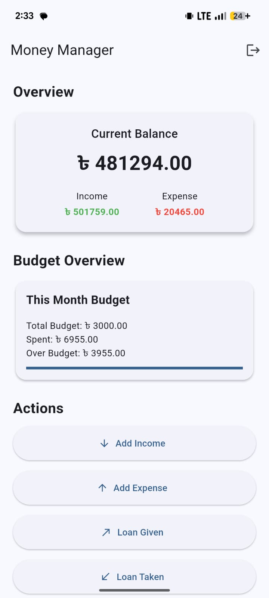
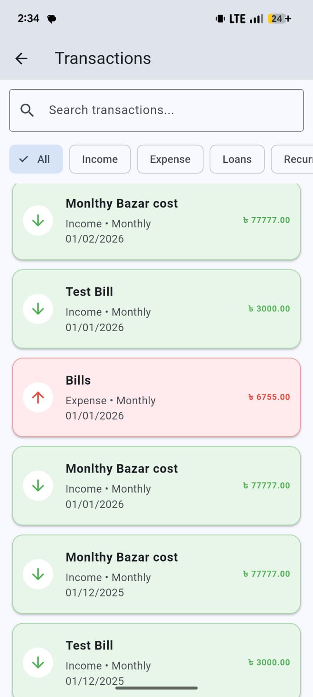
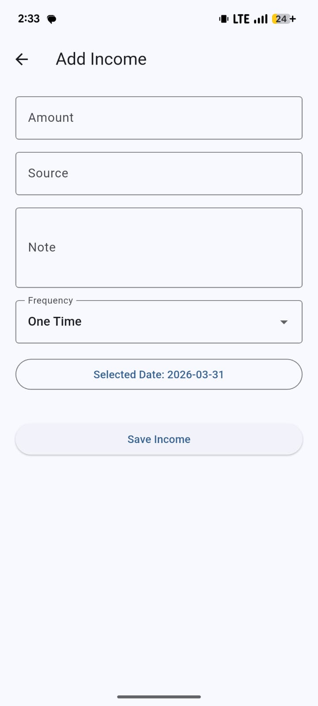
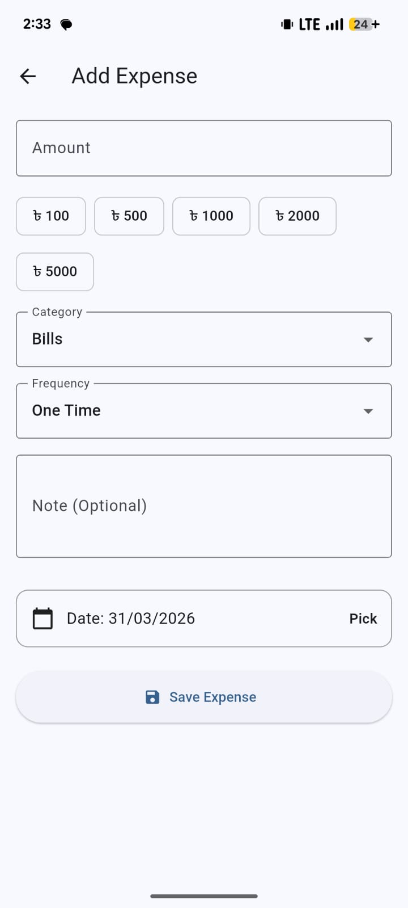
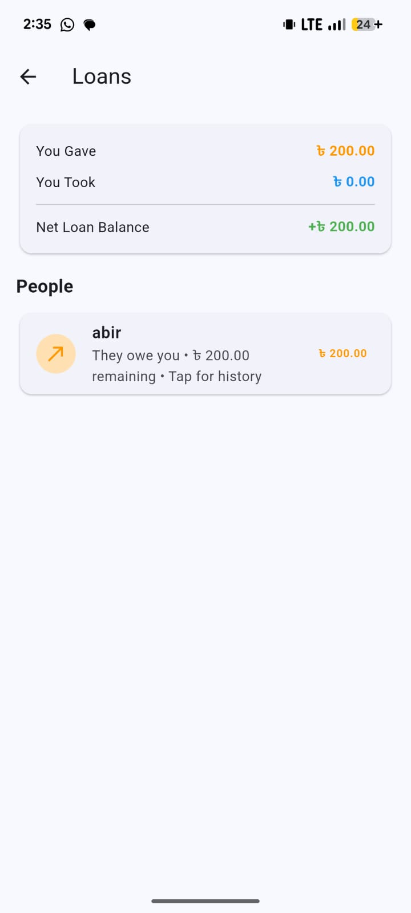
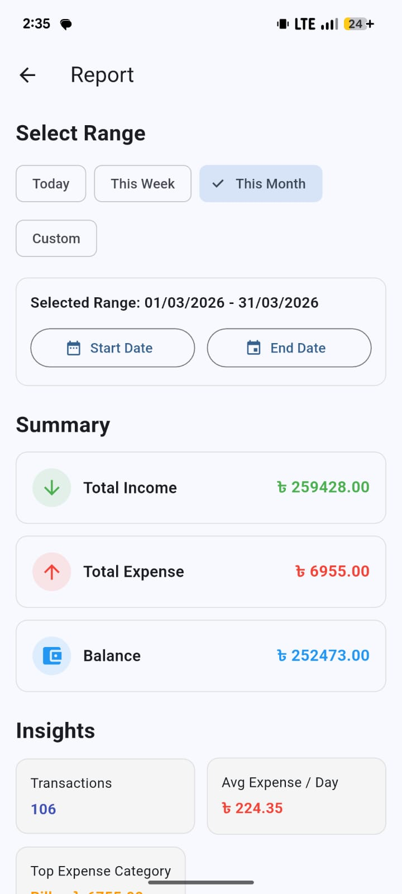

# 💰 Money Manager App (Flutter)

A complete personal finance management app built using Flutter.  
Track income, expenses, loans, and budgets with a clean and modern UI.

---

## 🚀 Features

- 🔐 Firebase Authentication (Login / Signup)
- 💵 Income & Expense Tracking
- 🔁 Recurring Transactions (Daily, Weekly, Monthly, Custom)
- 📊 Monthly Reports & Analytics
- 🧾 Receipt Attachment (Optional)
- 💳 Loan Management (Given / Taken / Settled)
- 📂 Category & Budget Management
- 📦 Backup & Restore (JSON)
- 📄 Export Data to CSV

---

## 📸 Screenshots

| Home | Transactions |
|------|-------------|
|  |  |

| Add Income | Add Expense |
|------------|------------|
|  |  |

| Loans | Reports |
|-------|--------|
|  |  |

---

## 📦 Download APK

👉 Go to **Releases section** to download and install the app.

---

## 🛠 Tech Stack

- Flutter (Dart)
- Firebase Authentication
- Cloud Firestore
- SharedPreferences (Local Storage)

---

## ⚠️ Note

- Firebase Storage is disabled in this demo version
- This is a demo build for showcasing features

---

## 👨‍💻 Developer

**Zakaria**  
Flutter Developer | AI/ML Enthusiast  

---

## ⭐ If you like this project

Give it a ⭐ on GitHub — it motivates me to build more!
